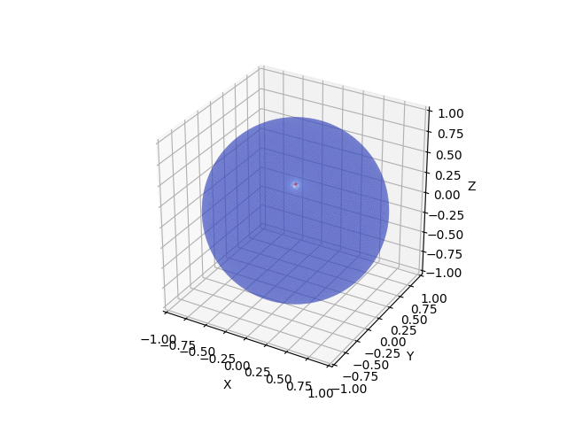
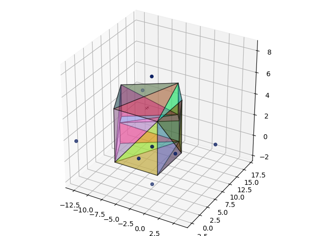
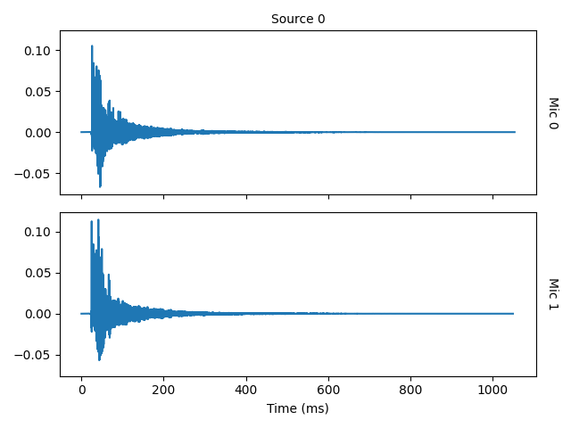
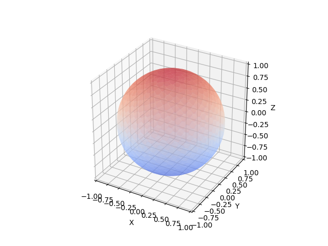

# PyRoomAcoustics 3D

## Overview

PyRoomAcoustics 3D is a Python repository showcasing advanced room acoustics simulations using the PyRoomAcoustics package. It includes scripts for simulating 3D sound propagation, estimating the direction of arrival (DoA) of sound sources, and visualizing room acoustics from 3D models.

## Contents

1. **doa_algorithms.py**: Demonstrates the estimation of the direction of arrival (DoA) of a sound source using various algorithms. The script creates a 3D simulation of a room, adds a sound source and a microphone array, and estimates the DoA.

   

   This image shows the DoA estimation results using a grid sphere visualization.

   **Execution Results (MUSIC Algorithm):**

   | Parameter  | Real Source (degrees) | Estimated Source (degrees) |
   | ---------- | --------------------: | -------------------------: |
   | Azimuth    |                   -60 |                   -59.7117 |
   | Colatitude |                    45 |                    44.4377 |

2. **room_from_stl.py**: Illustrates how to create a realistic 3D room acoustic model from an STL file. This script imports a 3D model, creates a room, and simulates the room's impulse response.

   

   The room layout generated from the STL file.

   

   The Room Impulse Response (RIR) plot for the simulated room.

3. **display_grid_sphere.py**: A utility script used for visualizing results on a 3D grid sphere. It is used in conjunction with the DoA estimation script to display results.

   

   An example of a grid sphere visualization.

## Usage

Each script can be run individually. For example:

```
python doa_algorithms.py --method MUSIC
```

This command runs the DoA estimation using the MUSIC algorithm. The methods supported are MUSIC, FRIDA, WAVES, TOPS, CSSM, SRP, and NormMUSIC.

For `room_from_stl.py`, provide the path to an STL file:

```
python room_from_stl.py --file path/to/yourfile.stl
```
